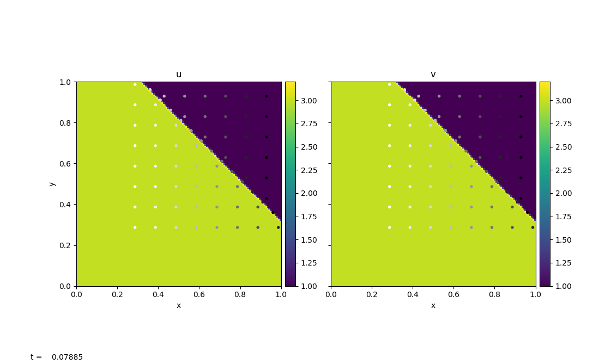
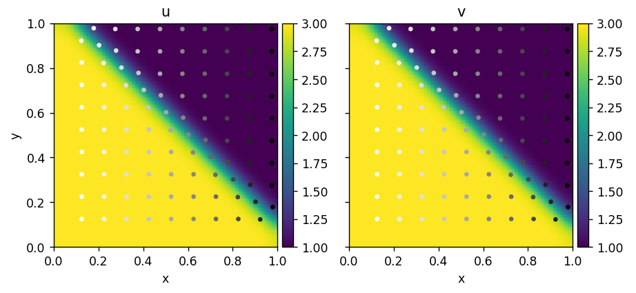

Burgers' Equation
==================

Burgers' Equation is a nonlinear hyperbolic equation. It has the same form as the advection equation, except that the quantity being advected is the velocity itself.

``Inviscid Burgers``
--------------------------------

A 2D inviscid Burgers' Equation has the following form:

.. math::

   u_t + u u_x + v u_y = 0\\
   v_t + u v_x + v v_y = 0

Here we have two 2D advection equations, where the x-velocity, :math:`u`, and y-velocity, :math:`v`, are the two quantities that we wish to advect with.

:py:mod:`pyro.burgers` is modified based on the :py:mod:`pyro.advection` with a different Riemann solver and timestep restriction.

Since velocity is no longer a constant, the timestep is now restricted to the each minimum velocity in each cell:

.. math::

   \Delta t < \min \left \{ \min \left \{ \frac{\Delta x}{|u_i|} \right \}, \min \left \{ \frac{\Delta y}{|v_i|}  \right \}  \right \}

The main difference of Burgers equation compared to the linear advection equation is the creation of shock and rarefactions due velocity been non-constant. This introduces a slightly different Riemann's problem which depends on shock speed by using the *Rankine-Hugoniot* jump condition.

The parameters for this solver are:

.. include:: burgers_defaults.inc

The figure above is generated using ``burgers/problems/test.py``, which is used to test the validity of the solver. Bottom-left of the domain has a higher velocity than the top-right domain. With :math:`u_{i,j}=v_{i,j}`, the wave travels diagonally to the top-right with a constant velocity that is equal to the shock speed. ``burgers/problem/verify.py`` can be used to calculate the wave speed using outputs from ``test.py`` and compare to the theoretical shock speed.

``Viscous Burgers``
--------------------------------

A 2D viscous Burgers' Equation has the following form:

.. math::

   u_t + u u_x + v u_y = \epsilon \left( u_{xx} + u_{yy}\right) \\
   v_t + u v_x + v v_y = \epsilon \left( v_{xx} + v_{yy}\right)

The viscous Burgers' equation has an additional velocity diffusion term on the RHS compared to the inviscid Burgers' equation. Here :math:`\epsilon` represents the constant viscosity.

:py:mod:`pyro.viscous_burgers` is inherited from :py:mod:`pyro.burgers`, where we added an additional diffusion term when constructing the interface states. We then solve for diffusion along with the extra advective source to the Helmholtz equation by using the Crank-Nicolson discretization and multigrid solvers.

The parameters for this solver are:

.. include:: viscous_burgers_defaults.inc

The figure above is generated using ``viscous_burgers/problems/test.py``, which has the identical setup as in ``burgers/problems/test.py``. With diffusion added to the system, we see the shock (discontinuity) is smeared out as system evolves.

