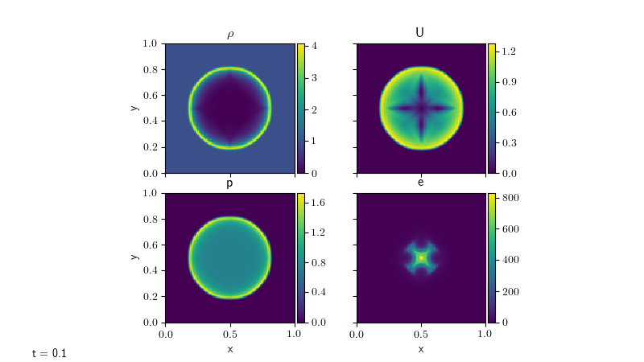

Compressible Problems with different solvers
============================================

We run various problems run with the different compressible solvers in pyro (standard Riemann, Runge-Kutta, fourth order).

Kelvin-Helmholtz
----------------
The McNally Kelvin-Helmholtz problem sets up a heavier fluid moving in the negative x-direction sandwiched between regions of lighter fluid moving in the positive x-direction.

The image below shows the KH problem initialized with McNally's test. It had a resolution of 128 in the x and y-directions, gamma = 1.7, and ran until t = 2.0. This is run with::

  ./pyro.py compressible kh inputs.kh kh.vbulk=0

  ./pyro.py compressible_rk kh inputs.kh kh.vbulk=0

  ./pyro.py compressible_fv4 kh inputs.kh kh.vbulk=0

.. image:: ./solver_comparisons/kh.png

We vary the velocity in the positive y-direction (vbulk) to see how effective the solvers are at preserving the initial shape.

Sedov Shock
-----------

The Sedov shock problem ran with a resolution of 128 in the x and y-directions, gamma = 1.4, and until t = 0.1, which can be run as::
  
  ./pyro.py compressible sedov inputs.sedov
  

::
  
  ./pyro.py compressible_rk sedov inputs.sedov

.. image:: ./solver_comparisons/sedov_rk.png
  
::
      
  ./pyro.py compressible_fv4 sedov inputs.sedov

