Compressible solver comparisons
===============================

We run various problems run with the different compressible solvers in pyro (standard Riemann, Runge-Kutta, fourth order).

Kelvin-Helmholtz
^^^^^^^^^^^^^^^^
The McNally Kelvin-Helmholtz problem sets up a heavier fluid moving in the negative x-direction sandwiched between regions of lighter fluid moving in the positive x-direction.

The image below shows the KH problem initialized with McNally's test. It ran on a 128 x 128 grid, with gamma = 1.7, and ran until t = 2.0. This is run with:

.. code-block:: none

  ./pyro_sim.py compressible kh inputs.kh kh.vbulk=0
  ./pyro_sim.py compressible_rk kh inputs.kh kh.vbulk=0
  ./pyro_sim.py compressible_fv4 kh inputs.kh kh.vbulk=0
  ./pyro_sim.py compressible_sdc kh inputs.kh kh.vbulk=0

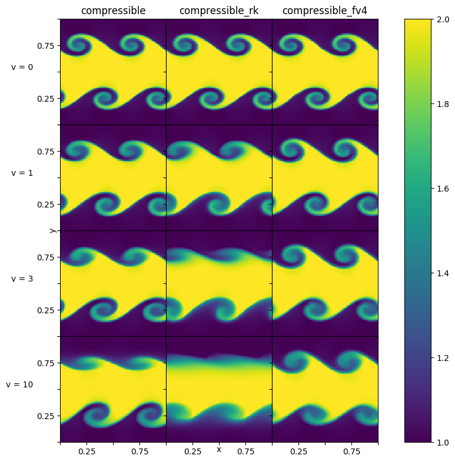

We vary the velocity in the positive y-direction (vbulk) to see how effective the solvers are at preserving the initial shape.

Sedov
^^^^^
The Sedov problem ran on a 128 x 128 grid, with gamma = 1.4, and until t = 0.1, which can be run as:

.. code-block:: none

   ./pyro_sim.py compressible sedov inputs.sedov
   ./pyro_sim.py compressible_rk sedov inputs.sedov
   ./pyro_sim.py compressible_fv4 sedov inputs.sedov
   ./pyro_sim.py compressible_sdc sedov inputs.sedov

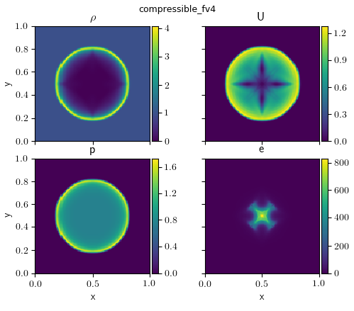

.. image:: ./solver_comparisons/sedov_sdc.png
   :align: center

Quad
^^^^
The quad problem ran on a 256 x 256 grid until t = 0.8, which can be run as:

.. code-block:: none

   ./pyro_sim.py compressible quad inputs.quad
   ./pyro_sim.py compressible_rk quad inputs.quad
   ./pyro_sim.py compressible_fv4 quad inputs.quad
   ./pyro_sim.py compressible_sdc quad inputs.quad

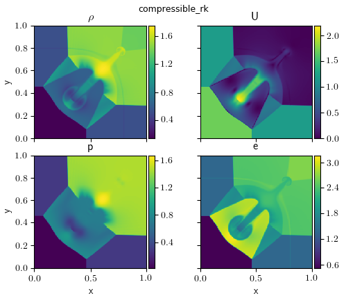

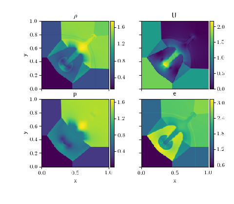

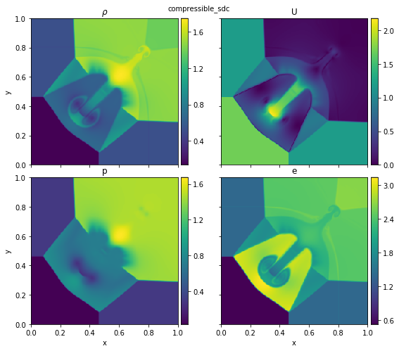

Bubble
^^^^^^
The bubble problem ran on a 128 x 256 grid until t = 3.0, which can be run as:

.. code-block:: none

   ./pyro_sim.py compressible bubble inputs.bubble
   ./pyro_sim.py compressible_rk bubble inputs.bubble
   ./pyro_sim.py compressible_fv4 bubble inputs.bubble
   ./pyro_sim.py compressible_sdc bubble inputs.bubble

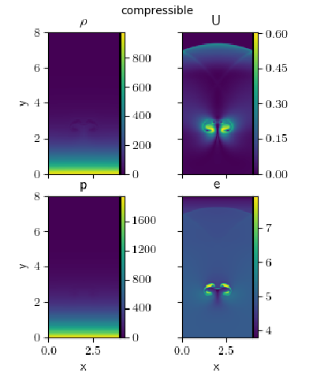

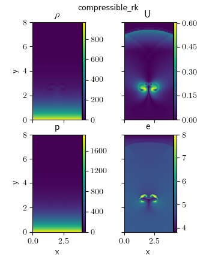

.. image:: ./solver_comparisons/bubble_fv4.png
   :align: center

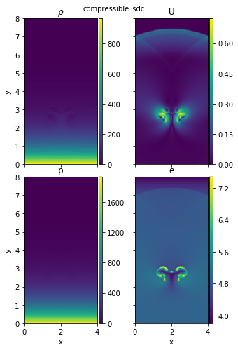

Rayleigh-Taylor
^^^^^^^^^^^^^^^
The Rayleigh-Taylor problem ran on a 64 x 192 grid until t = 3.0, which can be run as:

.. code-block:: none

   ./pyro_sim.py compressible rt inputs.rt
   ./pyro_sim.py compressible_rk rt inputs.rt
   ./pyro_sim.py compressible_fv4 rt inputs.rt
   ./pyro_sim.py compressible_sdc rt inputs.rt

.. image:: ./solver_comparisons/rt.png
   :align: center

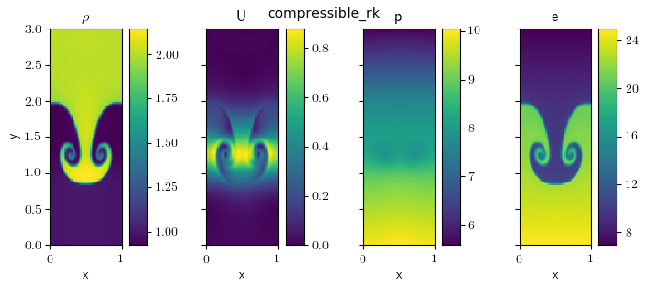

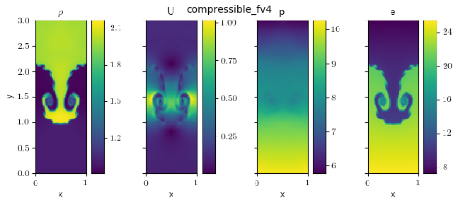

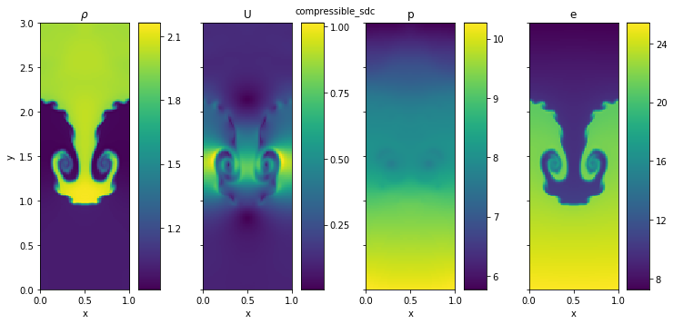
