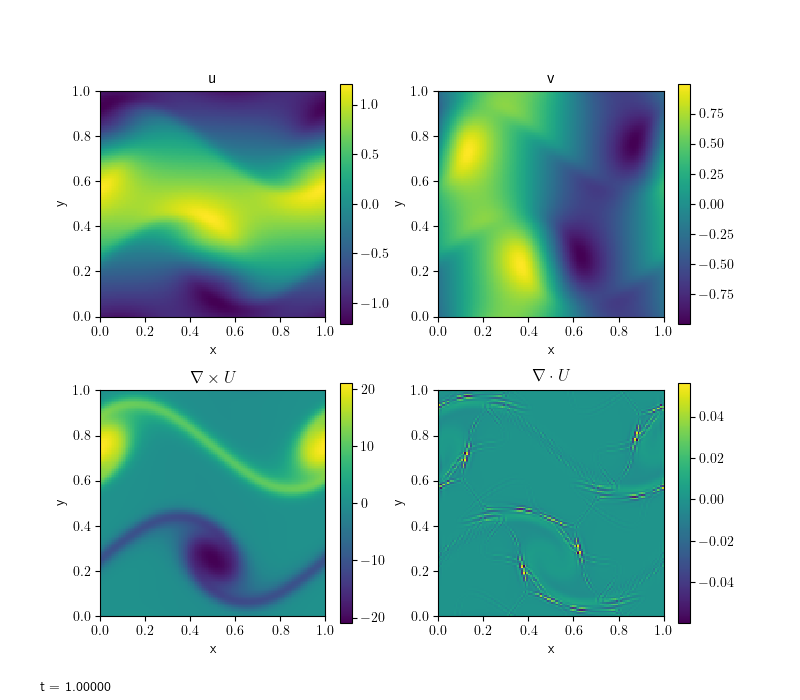
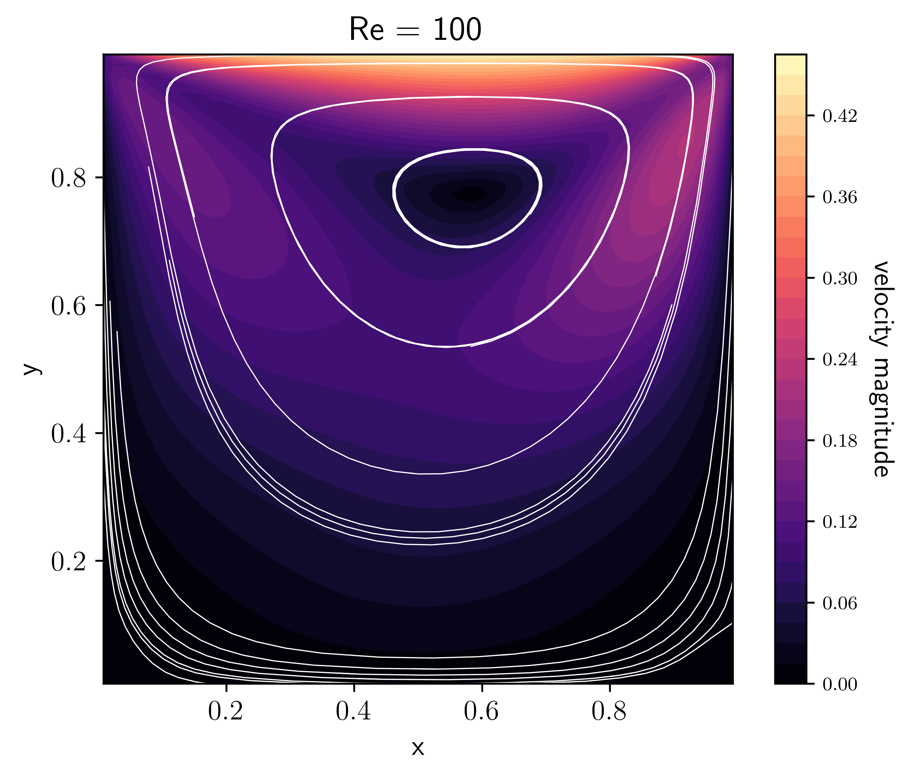
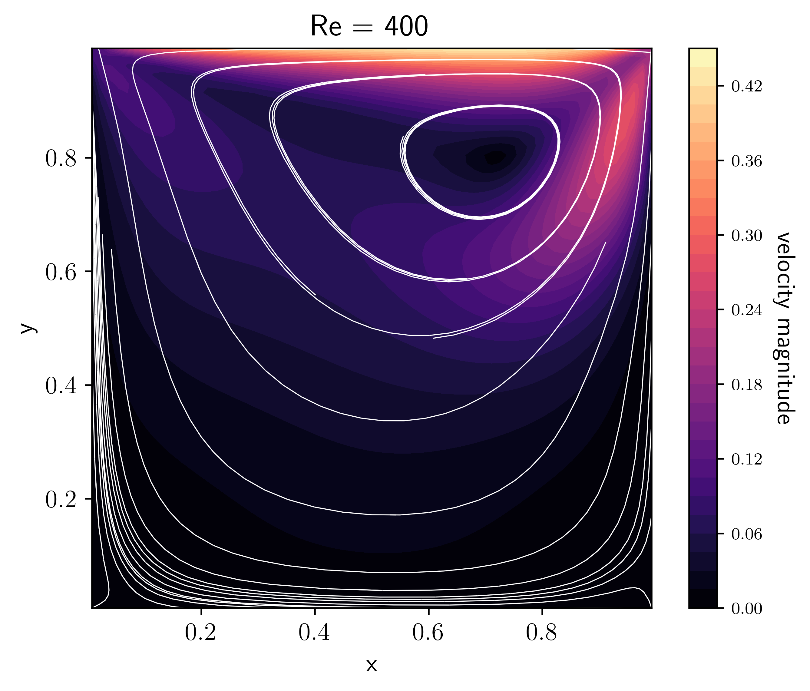
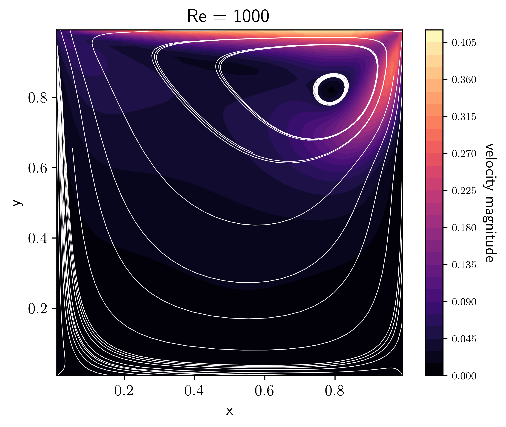
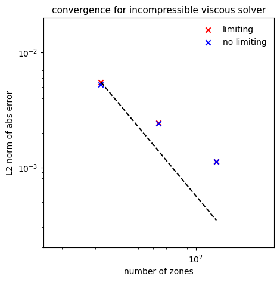

****************************
Incompressible hydrodynamics
****************************

pyro has two different incompressible solvers: ``incompressible`` is
inviscid and ``incompressible_viscous`` has viscosity.

``incompressible`` solver
=========================

pyro's incompressible solver solves:

.. math::

   \frac{\partial U}{\partial t} + U \cdot \nabla U + \nabla p &= 0 \\
   \nabla \cdot U &= 0

The algorithm combines the Godunov/advection features
used in the advection and compressible solver together with multigrid
to enforce the divergence constraint on the velocities.

Here we implement a cell-centered approximate projection method for
solving the incompressible equations. At the moment, only periodic BCs
are supported.

The main parameters that affect this solver are:

.. include:: incompressible_defaults.inc

.. include:: incompressible_problems.inc

Examples
--------

shear
^^^^^

The shear problem initializes a shear layer in a domain with
doubly-periodic boundaries and looks at the development of two
vortices as the shear layer rolls up. This problem was explored in a
number of papers, for example, :cite:`bellcolellaglaz:1989` and
:cite:`martincolella:2000`. This is run as:

.. prompt:: bash

   pyro_sim.py incompressible shear inputs.shear

.. image:: shear.png
   :align: center

The vorticity panel (lower left) is what is usually shown in
papers. Note that the velocity divergence is not zero—this is because
we are using an approximate projection.

convergence
^^^^^^^^^^^

The convergence test initializes a simple velocity field on a periodic
unit square with known analytic solution. By evolving at a variety of
resolutions and comparing to the analytic solution, we can measure the
convergence rate of the algorithm. The particular set of initial
conditions is from :cite:`minion:1996`. Limiting can be disabled by
adding ``incompressible.limiter=0`` to the run command. The basic set of
tests shown below are run as:

.. prompt:: bash

   pyro_sim.py incompressible converge inputs.converge.32 vis.dovis=0
   pyro_sim.py incompressible converge inputs.converge.64 vis.dovis=0
   pyro_sim.py incompressible converge inputs.converge.128 vis.dovis=0

The error is measured by comparing with the analytic solution using
the routine ``incomp_converge_error.py`` in ``analysis/``. To generate
the plot below, run

.. prompt:: bash

   python incompressible/tests/convergence_errors.py convergence_errors.txt

or ``convergence_errors_no_limiter.txt`` after running with that option. Then:

.. prompt:: bash

   python incompressible/tests/convergence_plot.py

.. image:: incomp_converge.png
   :align: center

The dashed line is second order convergence. We see almost second
order behavior with the limiters enabled and slightly better than
second order with no limiting.

``incompressible_viscous`` solver
=================================

pyro's incompressible viscous solver solves:

.. math::

   \frac{\partial U}{\partial t} + U \cdot \nabla U + \nabla p &= \nu \nabla^2 U \\
   \nabla \cdot U &= 0

This is based on the ``incompressible`` solver, but modifies the
velocity update step to take viscosity into account, by solving two
parabolic equations (one for each velocity component) using multigrid.

The main parameters that affect this solver are:

.. include:: incompressible_viscous_defaults.inc

.. include:: incompressible_viscous_problems.inc

Examples
--------

shear
^^^^^

The same shear problem as in incompressible solver, here with viscosity
added.

.. prompt:: bash

   pyro_sim.py incompressible_viscous shear inputs.shear

Compare this with the inviscid result. Notice how the velocities have 
diffused in all directions.

cavity
^^^^^^

The lid-driven cavity is a well-known benchmark problem for hydro codes
(see e.g. :cite:t:`ghia1982`, :cite:t:`Kuhlmann2019`). In a unit square box 
with initially static fluid, motion is initiated by a "lid" at the top 
boundary, moving to the right with unit velocity. The basic command is:

.. prompt:: bash

   pyro_sim.py incompressible_viscous cavity inputs.cavity

It is interesting to observe what happens when varying the viscosity, or, 
equivalently the Reynolds number (in this case :math:`\rm{Re}=1/\nu` since 
the characteristic length and velocity scales are 1 by default).

|pic1| |pic2| |pic3|

These plots were made by allowing the code to run for longer and approach a
steady-state with the option ``driver.max_steps=1000``, then running 
(e.g. for the Re=100 case):

.. prompt:: bash

   python incompressible_viscous/problems/plot_cavity.py cavity_n64_Re100_0406.h5 -Re 100 -o cavity_Re100.png

convergence
^^^^^^^^^^^

This is the same test as in the incompressible solver. With viscosity,
an exponential term is added to the solution. Limiting can again be 
disabled by adding ``incompressible.limiter=0`` to the run command.
The basic set of tests shown below are run as:

.. prompt:: bash

   pyro_sim.py incompressible_viscous converge inputs.converge.32 vis.dovis=0
   pyro_sim.py incompressible_viscous converge inputs.converge.64 vis.dovis=0
   pyro_sim.py incompressible_viscous converge inputs.converge.128 vis.dovis=0

The error is measured by comparing with the analytic solution using
the routine ``incomp_viscous_converge_error.py`` in ``analysis/``. To 
generate the plot below, run

.. prompt:: bash

   python incompressible_viscous/tests/convergence_errors.py convergence_errors.txt

or ``convergence_errors_no_limiter.txt`` after running with that option. Then:

.. prompt:: bash

   python incompressible_viscous/tests/convergence_plot.py

The solver is converging but below second-order, unlike the inviscid case. Limiting
does not seem to make a difference here.

Exercises
=========

Explorations
------------

* Disable the MAC projection and run the converge problem—is the method still 2nd order?

* Disable all projections—does the solution still even try to preserve :math:`\nabla \cdot U = 0`?

* Experiment with what is projected. Try projecting :math:`U_t` to see if that makes a difference.

* In the lid-driven cavity problem, when does the solution reach a steady-state?

* :cite:`ghia1982` give benchmark velocities at different Reynolds number for the
  lid-driven cavity problem (see their Table I). Do we agree with their results?

Extensions
----------

* Switch the final projection from a cell-centered approximate
  projection to a nodal projection. This will require writing a new
  multigrid solver that operates on nodal data.

* Switch to a variable density system. This will require adding a mass
  continuity equation that is advected and switching the projections
  to a variable-coefficient form (since ρ now enters).

