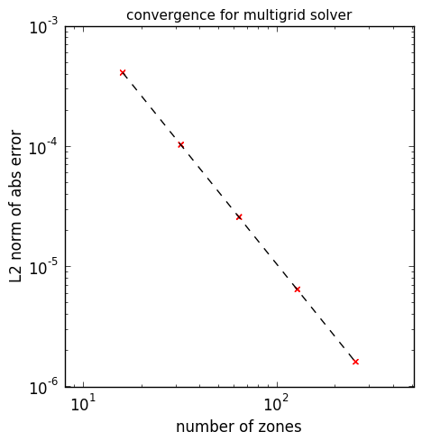
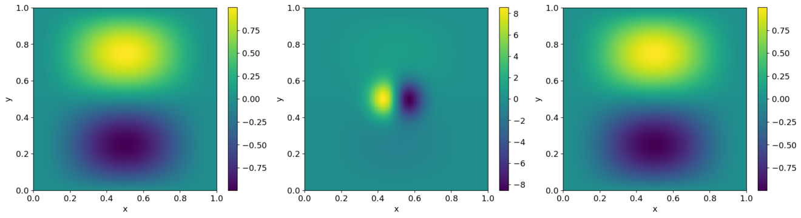

Simple Multigrid Examples
=========================

Known Solution
--------------

A basic multigrid test is run as (using a path relative to the root of the
``pyro2`` repository):

.. prompt:: bash

   ./pyro/multigrid/examples/mg_test_simple.py

The `mg_test_simple.py <https://github.com/python-hydro/pyro2/blob/main/pyro/multigrid/examples/mg_test_simple.py>`_ script solves a Poisson equation with a
known analytic solution. This particular example comes from the text
`A Multigrid Tutorial, 2nd Ed.`, by Briggs. The example is:

.. math::

   u_{xx} + u_{yy} = -2 \left [(1-6x^2)y^2(1-y^2) + (1-6y^2)x^2(1-x^2)\right ]

on :math:`[0,1] \times [0,1]` with :math:`u = 0` on the boundary.

The solution to this is shown below.

.. image:: mg_test.png
   :align: center

Since this has a known analytic solution:

.. math::

   u(x,y) = (x^2 - x^4)(y^4 - y^2)

We can assess the convergence of our solver by running at a variety of
resolutions and computing the norm of the error with respect to the
analytic solution. This is shown below:

The dotted line is 2nd order convergence, which we match perfectly.

The movie below shows the smoothing at each level to realize this solution:

.. raw:: html

    

        <iframe src="https://www.youtube.com/embed/h9MUgwJvr-g?rel=0" frameborder="0" allowfullscreen style="position: absolute; top: 0; left: 0; width: 100%; height: 100%;"></iframe>
    
 

You can run this example locally by running the ``mg_vis.py`` script:

.. prompt:: bash

   ./pyro/multigrid/examples/mg_vis.py

Projection
----------

Another example uses multigrid to extract the divergence free part of a velocity
field.  The script to run this is `project_periodic.py <https://github.com/python-hydro/pyro2/blob/main/pyro/multigrid/examples/project_periodic.py>`_.  This is run as:

.. prompt:: bash

   ./pyro/multigrid/examples/project_periodic.py

Given a vector field, :math:`U`, we can decompose it into a divergence
free part, :math:`U_d`, and the gradient of a scalar, :math:`\phi`:

.. math::

   U = U_d + \nabla \phi

We can project out the divergence free part by taking the divergence,
leading to an elliptic equation:

.. math::

   \nabla^2 \phi = \nabla \cdot U

The ``project-periodic.py`` script starts with a divergence free
velocity field, adds to it the gradient of a scalar, and then projects
it to recover the divergence free part. The error can found by
comparing the original velocity field to the recovered field. The
results are shown below:

Left is the original u velocity, middle is the modified field after
adding the gradient of the scalar, and right is the recovered field.

Exercises
---------

Explorations
^^^^^^^^^^^^

* Try doing just smoothing, no multigrid. Show that it still converges
  second order if you use enough iterations, but that the amount of
  time needed to get a solution is much greater.

Extensions
^^^^^^^^^^

* Add a different bottom solver to the multigrid algorithm

* Make the multigrid solver work for non-square domains

* Implement the full-multigrid algorithm instead of just V-cycles
