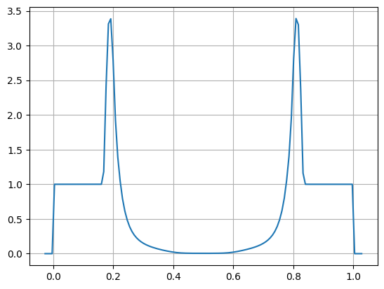

Working with output
===================

Utilities
---------

Several simply utilities exist to operate on output files

* ``compare.py:`` this script takes two plot files and compares them
  zone-by-zone and reports the differences. This is useful for
  testing, to see if code changes affect the solution. Many problems
  have stored benchmarks in their solver's tests directory. For
  example, to compare the current results for the incompressible shear
  problem to the stored benchmark, we would do:

  .. code-block:: none

    ./compare.py shear_128_0216.pyro incompressible/tests/shear_128_0216.pyro

  Differences on the order of machine precision may arise because
  of optimizations and compiler differences across platforms. Students
  should familiarize themselves with the details of how computers
  store numbers (floating point). An excellent read is `What every
  computer scientist should know about floating-point arithmetic`
  by D. Goldberg.

* ``plot.py``: this script uses the solver's ``dovis()`` routine to
  plot an output file. For example, to plot the data in the file
  ``shear_128_0216.pyro`` from the incompressible shear problem, you
  would do:

  .. code-block:: none

     ./plot.py -o image.png shear_128_0216.pyro

  where the ``-o`` option allows you to specify the output file name.

Reading and plotting manually
-----------------------------

pyro data can be read using the ``patch.read`` method. The following
sequence (done in a python session) reads in stored data (from the
compressible Sedov problem) and plots data falling on a line in the x
direction through the y-center of the domain (note: this will include
the ghost cells).

.. code-block:: python

   import matplotlib.pyplot as plt
   import util.io as io
   sim = io.read("sedov_unsplit_0000.h5")
   dens = sim.cc_data.get_var("density")
   plt.plot(dens.g.x, dens[:,dens.g.ny//2])
   plt.show()

Note: this includes the ghost cells, by default, seen as the small
regions of zeros on the left and right.
