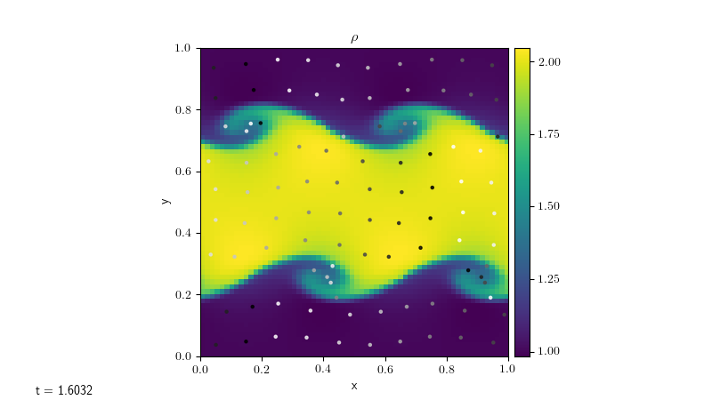

Particles
=========

A solver for modelling particles.

``particles.particles`` implementation and use
----------------------------------------------

We import the basic particles module functionality as:

.. code-block:: python

   import particles.particles as particles

The particles solver is made up of two classes:

* :func:`Particle <particles.particles.Particle>`, which holds
  the data about a single particle (its position and velocity);
* :func:`Particles <particles.particles.Particles>`, which holds the data
  about a collection of particles.

The particles are stored as a dictionary, and their positions are updated
based on the velocity on the grid. The keys are tuples of the particles'
initial positions (however the values of the keys themselves are never used
in the module, so this could be altered using e.g. a custom ``particle_generator``
function without otherwise affecting the behaviour of the module).

The particles can be initialized in a number of ways:

* :func:`randomly_generate_particles <particles.particles.Particles.randomly_generate_particles>`,
  which randomly generates ``n_particles`` within the domain.
* :func:`grid_generate_particles <particles.particles.Particles.grid_generate_particles>`,
  which will generate approximately ``n_particles`` equally spaced in the
  x-direction and y-direction (note that it uses the same number of particles in
  each direction, so the spacing will be different in each direction if the
  domain is not square). The number of particles will be increased/decreased
  in order to fill the whole domain.
* :func:`array_generate_particles <particles.particles.Particles.array_generate_particles>`,
  which generates particles based on array of particle positions passed to the
  constructor.
* The user can define their own ``particle_generator`` function and pass this into the
  ``Particles`` constructor. This function takes the number of particles to be
  generated and returns a dictionary of ``Particle`` objects.

We can turn on/off the particles solver using the following runtime paramters:

+--------------------------------------------------------------------------------+
|``[particles]``                                                                 |
+=======================+========================================================+
|``do_particles``       | do we want to model particles? (0=no, 1=yes)           |
+-----------------------+--------------------------------------------------------+
|``n_particles``        | number of particles to be modelled                     |
+-----------------------+--------------------------------------------------------+
|``particle_generator`` | how do we initialize the particles? "random"           |
|                       | randomly generates particles throughout the domain,    |
|                       | "grid" generates equally spaced particles, "array"     |
|                       | generates particles at positions given in an array     |
|                       | passed to the constructor. This option can be          |
|                       | overridden by passing a custom generator function to   |
|                       | the ``Particles`` constructor.                         |
+-----------------------+--------------------------------------------------------+

Using these runtime parameters, we can initialize particles in a problem using
the following code in the solver's ``Simulation.initialize`` function:

.. code-block:: python

   if self.rp.get_param("particles.do_particles") == 1:
         n_particles = self.rp.get_param("particles.n_particles")
         particle_generator = self.rp.get_param("particles.particle_generator")
         self.particles = particles.Particles(self.cc_data, bc, n_particles, particle_generator)

The particles can then be advanced by inserting the following code after the
update of the other variables in the solver's ``Simulation.evolve`` function:

.. code-block:: python

   if self.particles is not None:
        self.particles.update_particles(self.dt)

This will both update the positions of the particles and enforce the boundary
conditions.

For some problems (e.g. advection), the x- and y- velocities must also be passed
in as arguments to this function as they cannot be accessed using the standard
``get_var("velocity")`` command. In this case, we would instead use

.. code-block:: python

   if self.particles is not None:
        self.particles.update_particles(self.dt, u, v)

Plotting particles
------------------

Given the ``Particles`` object ``particles``, we can plot the particles by getting
their positions using

.. code-block:: python

   particle_positions = particles.get_positions()

In order to track the movement of particles over time, it's useful
to 'dye' the particles based on their initial positions. Assuming that the
keys of the particles dictionary were set as the particles' initial positions,
this can be done by calling

.. code-block:: python

   colors = particles.get_init_positions()

For example, if we color the particles from white to black based on their initial
x-position, we can plot them on the figure axis ``ax`` using the following code:

.. code-block:: python

      particle_positions = particles.get_positions()

      # dye particles based on initial x-position
      colors = particles.get_init_positions()[:, 0]

      # plot particles
      ax.scatter(particle_positions[:, 0],
          particle_positions[:, 1], s=5, c=colors, alpha=0.8, cmap="Greys")

      ax.set_xlim([myg.xmin, myg.xmax])
      ax.set_ylim([myg.ymin, myg.ymax])

Applying this to the Kelvin-Helmholtz problem with the ``compressible`` solver,
we can produce a plot such as the one below, where the particles have been
plotted on top of the fluid density.

