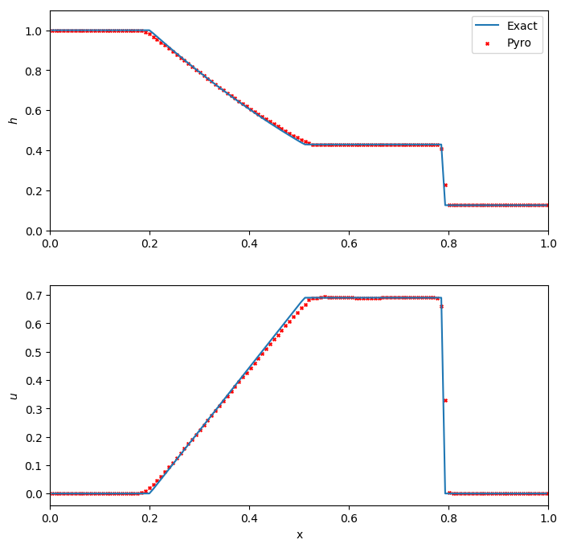

Shallow water solver
====================

The (augmented) shallow water equations take the form:

.. math::

   \frac{\partial h}{\partial t} + \nabla \cdot (h U) &= 0 \\
   \frac{\partial (h U)}{\partial t} + \nabla \cdot (h U U) + \frac{1}{2}g\nabla h^2 &= 0 \\
   \frac{\partial (h \psi)}{\partial t} + \nabla \cdot (h U \psi) &= 0

with :math:`h` is the fluid height, :math:`U` the fluid velocity, :math:`g` the
gravitational acceleration and :math:`\psi = \psi(x, t)` represents some
passive scalar.

The implementation here has flattening at shocks and a choice of Riemann solvers.

The main parameters that affect this solver are:

.. include:: swe_defaults.inc

Example problems
----------------

dam
^^^

The dam break problem is a standard hydrodynamics problem, analogous to the Sod
shock tube problem in compressible hydrodynamics. It considers a one-multidimensional
problem of two regions of fluid at different heights, initially separated by a dam.
The problem then models the evolution of the system when this dam is removed.
As for the Sod problem, there exists an exact solution for the dam break problem,
so we can check our solution against the exact solutions. See Toro's shallow water
equations book for details on this problem and the exact Riemann solver.

Because it is one-dimensional, we run it in narrow domains in the x- or
y-directions. It can be run as:

.. prompt:: bash

   pyro_sim.py swe dam inputs.dam.x
   pyro_sim.py swe dam inputs.dam.y

A simple script, ``dam_compare.py`` in ``analysis/`` will read a pyro
output file and plot the solution over the exact dam break solution
(as given by :cite:`stoker:1958` and :cite:`chao:1999`).  Below we see
the result for a dam break run with 128 points in the x-direction, and
run until t = 0.3 s.

We see excellent agreement for all quantities. The shock wave is very
steep, as expected. For this problem, the Roe-fix solver performs
slightly better than the HLLC solver, with less smearing at the shock
and head/tail of the rarefaction.

quad
^^^^

The quad problem sets up different states in four regions of the
domain and watches the complex interfaces that develop as shocks
interact. This problem has appeared in several places (and a `detailed
investigation
<http://planets.utsc.utoronto.ca/~pawel/Riemann.hydro.html>`_ is
online by Pawel Artymowicz). It is run as:

.. prompt:: bash

   pyro_sim.py swe quad inputs.quad

kh
^^

The Kelvin-Helmholtz problem models three layers of fluid: two at the top and
bottom of the domain travelling in one direction, one in the central part of the
domain travelling in the opposite direction. At the interface of the layers,
shearing produces the characteristic Kelvin-Helmholtz instabilities, just as
is seen in the standard compressible problem. It is run as:

.. prompt:: bash

   pyro_sim.py swe kh inputs.kh

Exercises
---------

Explorations
^^^^^^^^^^^^

* There are multiple Riemann solvers in the swe
  algorithm. Run the same problem with the different Riemann solvers
  and look at the differences. Toro's shallow water text is a good book to help
  understand what is happening.

* Run the problems with and without limiting—do you notice any overshoots?

Extensions
^^^^^^^^^^

* Limit on the characteristic variables instead of the primitive
  variables. What changes do you see? (the notes show how to implement
  this change.)

* Add a source term to model a non-flat sea floor (bathymetry).
